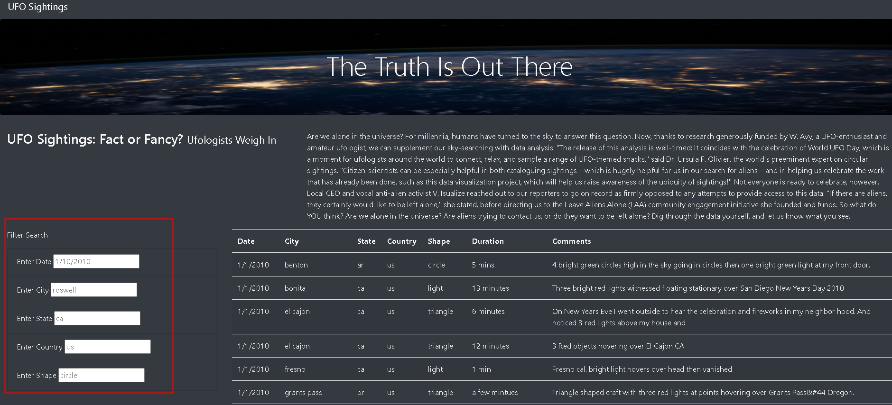

# UFOs: Fact or Fancy?
## Overview
This site uses JavaScript, CSS, and HTML to create a filterable table for the user to find alleged UFO sightings based on the criteria they input.  
## Results
The table can be filtered on the following criteria:
- Date
- City
- State
- Country
- UFO Shape

The filters give an example of how the input should be formatted for best resuts.  Example, state input should be entered as the state's abbreviation in lower case letters. 

Refreshing the page will reset the filters and the table will display all of the results.  
## Summary
Overall the site functions as intended but there are some limitations to it. One such limitation is that the filters need an exact text match to find the corresponding table matches.  Updating the filter to find partial text or similar text would help to improve the functionality.

  There are other updates that maybe beneficial for the site. The filters are free text so the user may input values that aren't in the table.  There are tons of city names but the user has to use trial and error to find one that had a sighting.  An update would be to make the filter a drop down menu list with all of available options.  Additionally, the current filters only allow for one selection at a time.  If a user wanted to find all sightings in, for example, Minnesota and Iowa, they would have to do two separate searches.  Updating the filters to also allow the user to see the available options as well as select multiple at a time would increase the functionality of the search. 
